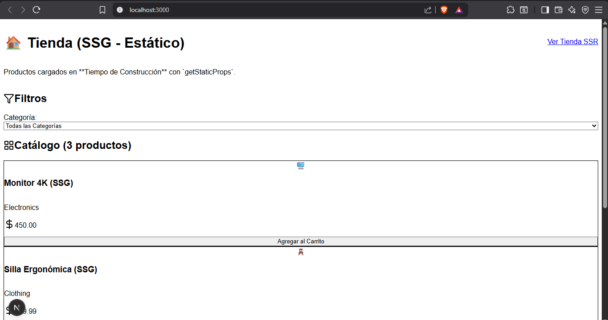
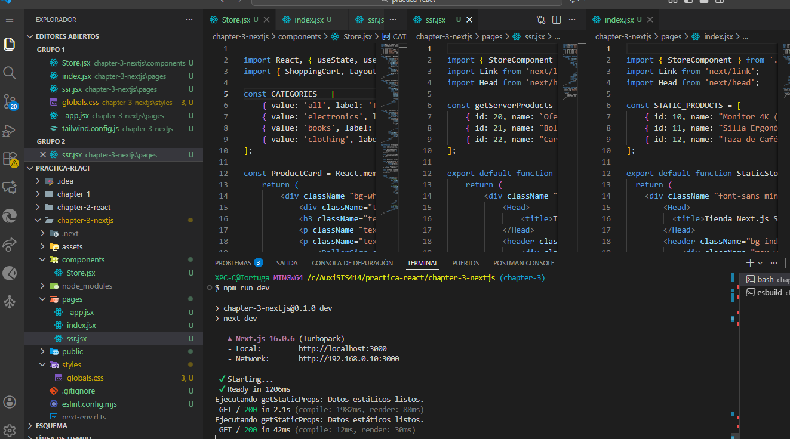

# Chapter 3 - Migración a Next.js

**Rama:** chapter-3

## Objetivo
Migrar a Next.js, enrutamiento y SSR/SSG.

## Qué hice

* Crear app Next.js usando el Pages Router.
* Migrar las páginas de la tienda (`index.jsx` y `ssr.jsx`) a la carpeta `pages/`.
* Implementar el componente `Store` (tienda con carrito) para la lógica de React.
* Configurar `_app.jsx` para la carga de estilos globales de Tailwind CSS.
* Implementar **Static Site Generation (SSG)** en la página principal (`/`).
* Implementar **Server-Side Rendering (SSR)** en la ruta dinámica (`/ssr`).

## Conceptos Clave Aprendidos

### 1. Sistema de Archivos para Enrutamiento (Pages Router)

Next.js utiliza la estructura de carpetas de `pages/` para definir las rutas automáticamente.

* `pages/index.jsx` -> Ruta `/` (Página de inicio)
* `pages/ssr.jsx` -> Ruta `/ssr`

### 2. Static Site Generation (SSG)

SSG permite que las páginas se generen una única vez durante el **tiempo de construcción (Build Time)**.

* **Función Clave:** `getStaticProps`
* **Uso:** Usado en la página principal (`/`) para cargar el catálogo de productos, ya que estos datos son semi-estáticos.
* **Ventaja:** Máxima velocidad de carga, ya que el archivo HTML estático se sirve desde una CDN.

### 3. Server-Side Rendering (SSR)

SSR permite que las páginas se generen **en el servidor en cada petición** del usuario.

* **Función Clave:** `getServerSideProps`
* **Uso:** Usado en la ruta `/ssr` para cargar datos dinámicos o que deben ser frescos (como la hora actual del servidor en la práctica).
* **Ventaja:** Garantiza que el usuario siempre vea la información más reciente.

## Comandos para correr
npm install
npm run dev

pgsql
Copiar código

## Capturas

## Commit asociado
`Add chapter 3 content: Implementación de SSG y SSR en Next.js con una tienda.`

**Autor:** Pedro Serrudo Llanos
**Fecha:** 3/12/25
